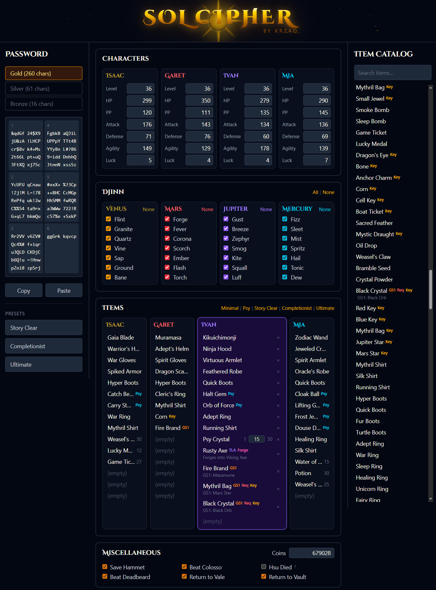

# Sol Cipher

A web-based Golden Sun password generator and decoder. Encode, decode, and edit all password data — characters, djinn, items, event flags, and coins — entirely in the browser.

**Live**: [solcipher.krzaq.cc](https://solcipher.krzaq.cc)



## Features

- Gold (260 char), Silver (61 char), and Bronze (16 char) passwords
- Full character stat editing (level, HP, PP, attack, defense, agility, luck)
- Djinn selection per element
- Item inventory management with searchable TLA item catalog (460+ items)
- Item presets: Minimal, Psy, Story Clear, Completionist, Ultimate
- Event flags and coin editing
- Shareable URLs via hash fragment
- Mobile-responsive layout with bottom sheet item catalog

## Tech

Vue 3 + TypeScript, Vite, Tailwind CSS. Entirely client-side — no backend, no database.

## Building

```
npm install
npm run dev     # dev server
npm run build   # production build → dist/
```

## Credits

- **[Paulygon](https://gamefaqs.gamespot.com/community/paulygon)** — creator of GoldenSunPasswords.exe, the original inspiration for this project
- **[Dyrati](https://github.com/Dyrati)** — BizHawk Lua script (`password_transfer.lua`) providing an independent codec implementation used as a test oracle
- **Straylite & Teaman** — contributors to the Lua password input implementation
- **[GS Data Wiki](https://gsdata.fandom.com)** — community documentation of Golden Sun data structures
- **[romhack/GoldenSunCompression](https://github.com/romhack/GoldenSunCompression)** — GBA asset decompression tools (MIT, Griever@Magicteam)
- **[IDA](https://hex-rays.com/ida-pro/)** — invaluable for verifying assumptions about the password protocol
- **[Claude](https://claude.ai)** — AI pair programming partner throughout development

## License

MIT
